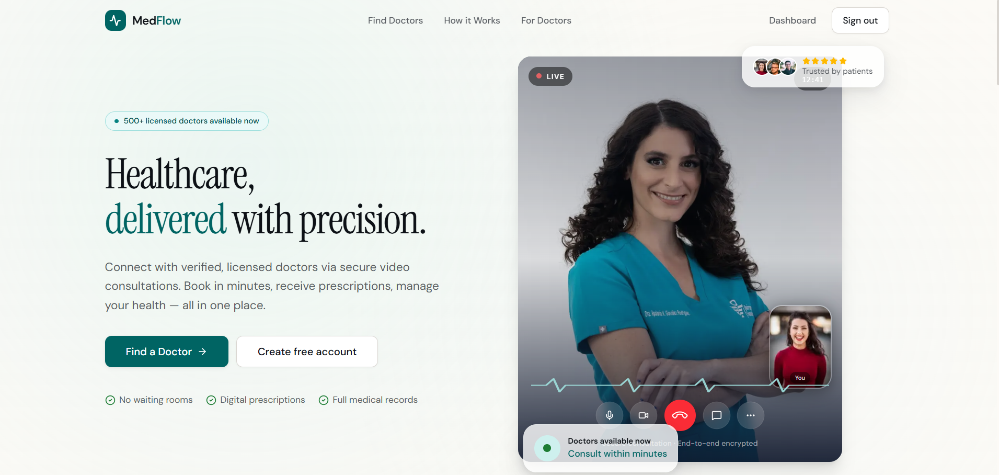
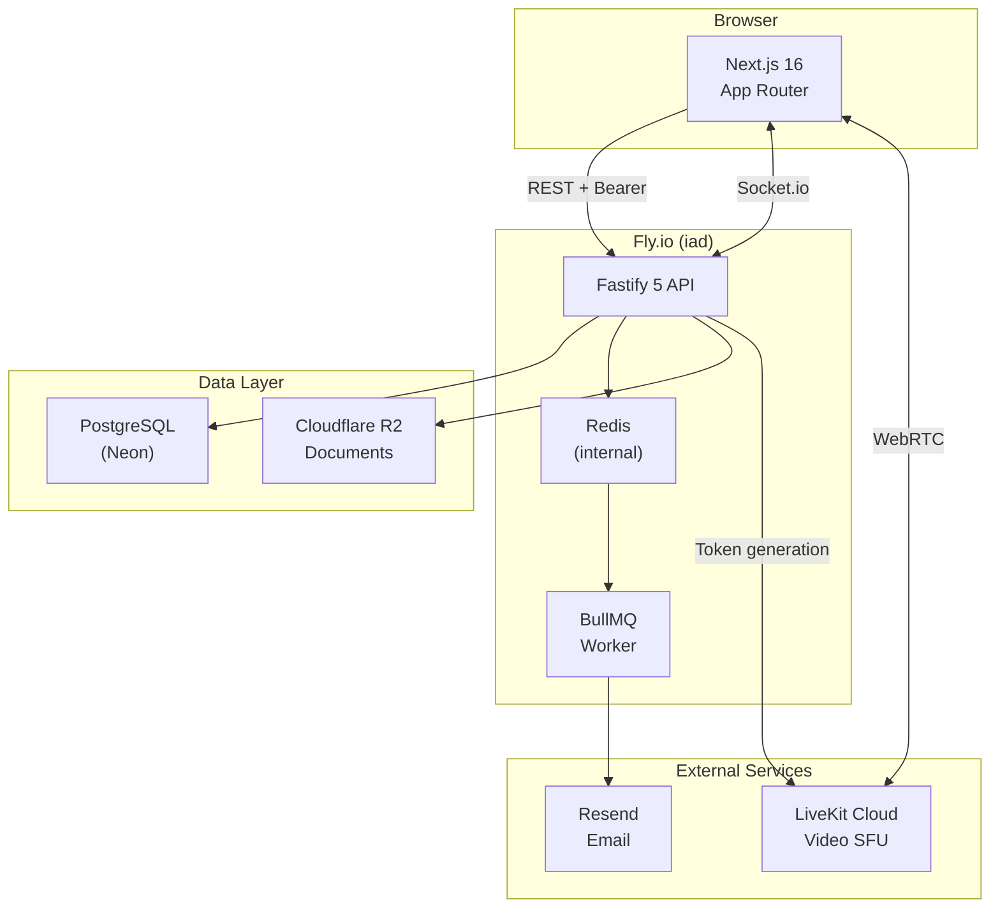
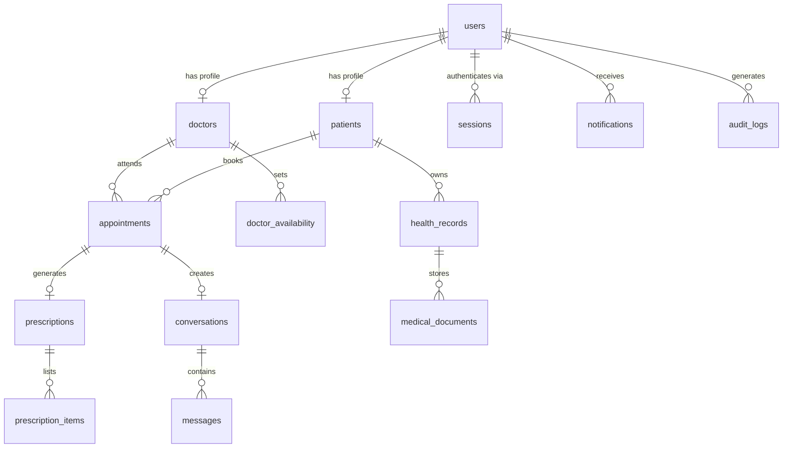

# MedFlow

**Telemedicine platform** — patients book secure video consultations with licensed doctors, receive digital prescriptions, and manage their health records in one place.

**Live:** [medflow-five.vercel.app](https://medflow-five.vercel.app) · **API:** [medflow-api.fly.dev/api/v1](https://medflow-api.fly.dev/api/v1)

---

## Architecture

---

## Features

| Role | Capabilities |
|------|-------------|
| **Patient** | Browse verified doctors, book video appointments, receive prescriptions, upload/view health records, encrypted messaging |
| **Doctor** | Manage schedule & availability, conduct video consultations, write prescriptions, access patient records |
| **Admin** | Verify doctor licenses, suspend users, view audit logs, platform statistics |

---

## Tech Stack

| Layer | Technology |
|-------|-----------|
| Frontend | Next.js 16 (App Router), React 19, TypeScript |
| Styling | Tailwind CSS v4, Framer Motion |
| State | TanStack Query v5, Zustand v5 |
| API | Fastify 5, Node.js 22, TypeScript |
| Database | PostgreSQL (Neon), Prisma 6 |
| Queue | BullMQ + Redis |
| Video | LiveKit Cloud (WebRTC) |
| Storage | Cloudflare R2 |
| Email | Resend |
| Monorepo | Turborepo + pnpm workspaces |
| Deploy | Vercel (web) · Fly.io (API + Redis) |

---

## Database Schema

---

## Docs

- [Setup & environment variables](docs/setup.md)
- [API reference](docs/api.md)
- [Deployment](docs/deployment.md)
- [Security](docs/security.md)

---

## License

MIT
