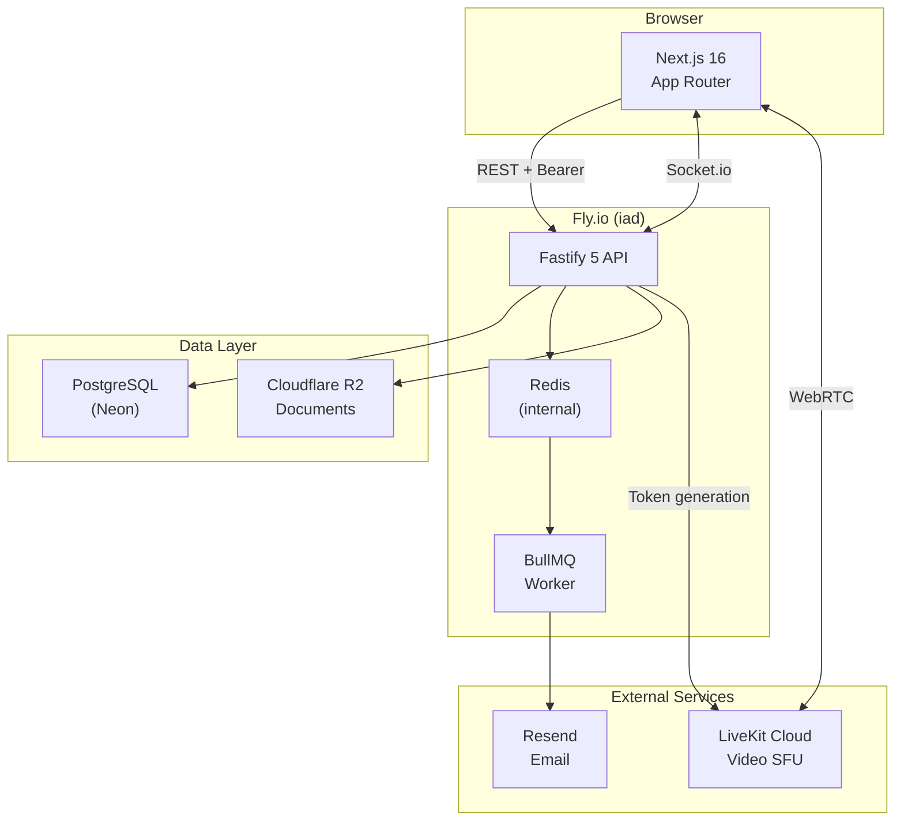
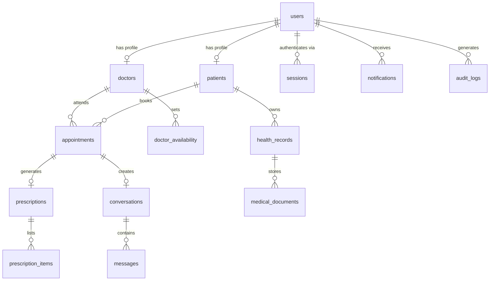

# MedFlow

**Telemedicine platform** — patients book secure video consultations with licensed doctors, receive digital prescriptions, and manage their health records in one place.

**Live:** [medflow-five.vercel.app](https://medflow-five.vercel.app) · **API:** [medflow-api.fly.dev/api/v1](https://medflow-api.fly.dev/api/v1)

---

## Architecture



---

## Features

| Role | Capabilities |
|------|-------------|
| **Patient** | Browse verified doctors, book video appointments, receive prescriptions, upload/view health records, encrypted messaging |
| **Doctor** | Manage schedule & availability, conduct video consultations, write prescriptions, access patient records |
| **Admin** | Verify doctor licenses, suspend users, view audit logs, platform statistics |

---

## Tech Stack

| Layer | Technology |
|-------|-----------|
| Frontend | Next.js 16 (App Router), React 19, TypeScript |
| Styling | Tailwind CSS v4, Framer Motion |
| State | TanStack Query v5, Zustand v5 |
| API | Fastify 5, Node.js 22, TypeScript |
| Database | PostgreSQL (Neon), Prisma 6 |
| Queue | BullMQ + Redis |
| Video | LiveKit Cloud (WebRTC) |
| Storage | Cloudflare R2 |
| Email | Resend |
| Monorepo | Turborepo + pnpm workspaces |
| Deploy | Vercel (web) · Fly.io (API + Redis) |

---

## Database Schema



---

## Getting Started

### Prerequisites

- Node.js 22
- pnpm 10
- PostgreSQL (or a [Neon](https://neon.tech) project)
- Redis

### Setup

```bash
# Install dependencies
pnpm install

# Copy env template and fill in values
cp apps/api/.env.example apps/api/.env

# Generate Prisma client + run migrations
pnpm db:generate
pnpm db:migrate

# Seed demo doctors
pnpm --filter @medflow/db db:seed

# Start all apps
pnpm dev
```

Frontend → `http://localhost:3000`
API → `http://localhost:3001`

---

## Environment Variables

Create `apps/api/.env`:

```env
DATABASE_URL=          # Neon pooler connection string
DIRECT_URL=            # Neon direct connection (migrations)
AUTH_SECRET=           # ≥32 chars, session signing key
ENCRYPTION_KEY=        # 64-char hex, AES-256 health record encryption
REDIS_URL=             # redis://...
RESEND_API_KEY=        # resend.com API key
LIVEKIT_URL=           # wss://your-project.livekit.cloud
LIVEKIT_API_KEY=       # LiveKit credentials
LIVEKIT_API_SECRET=    # LiveKit credentials
R2_ACCOUNT_ID=         # Cloudflare R2
R2_ACCESS_KEY_ID=      # Cloudflare R2
R2_SECRET_ACCESS_KEY=  # Cloudflare R2
R2_PUBLIC_URL=         # Public R2 base URL
FRONTEND_URL=          # http://localhost:3000 (dev)
API_URL=               # http://localhost:3001/api/v1 (dev)
```

Frontend: `NEXT_PUBLIC_API_URL` in `apps/web/.env.local` (optional — defaults to production API).

---

## Project Structure

```
medflow/
├── apps/
│   ├── api/                # Fastify REST API
│   │   └── src/
│   │       ├── routes/     # /auth /appointments /doctors /patients ...
│   │       ├── services/   # auth, appointment, scheduler, email
│   │       └── plugins/    # auth-guard, error-handler, audit
│   └── web/                # Next.js frontend
│       ├── app/
│       │   ├── (public)/   # Landing, doctors, legal pages
│       │   ├── dashboard/  # Patient portal
│       │   ├── doctor/     # Doctor portal
│       │   └── admin/      # Admin panel
│       ├── components/
│       ├── stores/         # Zustand (auth, notifications)
│       └── lib/api.ts      # Typed API client
├── packages/
│   ├── db/                 # Prisma schema + client
│   └── shared/             # Zod schemas, enums, constants
├── Dockerfile              # Multi-stage API build
└── fly.toml                # Fly.io config
```

---

## API Overview

Base path: `/api/v1/`
Auth: `Authorization: Bearer <token>` (opt-in per route)

| Group | Routes |
|-------|--------|
| `/auth` | Register (patient/doctor), login, logout, verify email, password reset |
| `/appointments` | Book, confirm, cancel, complete, video token, available slots |
| `/doctors` | Public search, public profiles, availability management |
| `/patients` | Profile management, patient records (doctor/admin scoped) |
| `/prescriptions` | Create, view, status management |
| `/health-records` | EHR CRUD, vitals, document upload/download |
| `/messages` | Encrypted conversations, E2E key exchange |
| `/notifications` | List, mark read |
| `/admin` | User management, doctor verification, audit logs, stats |

---

## Deploy

**Frontend (Vercel)**
```bash
cd apps/web && npx vercel --prod --yes
```

**API (Fly.io)**
```bash
flyctl deploy
```

Migrations run automatically at container startup.

---

## Security

- Passwords hashed with **scrypt** (32-byte salt, 64-byte key)
- Health record content encrypted at rest (**AES-256-GCM**)
- Messages use **end-to-end encryption** (ECDH key exchange)
- All DB sessions invalidated on logout
- Audit log retention: 6 years
- HIPAA-aligned — see [/hipaa](https://medflow-five.vercel.app/hipaa)

---

## License

MIT
